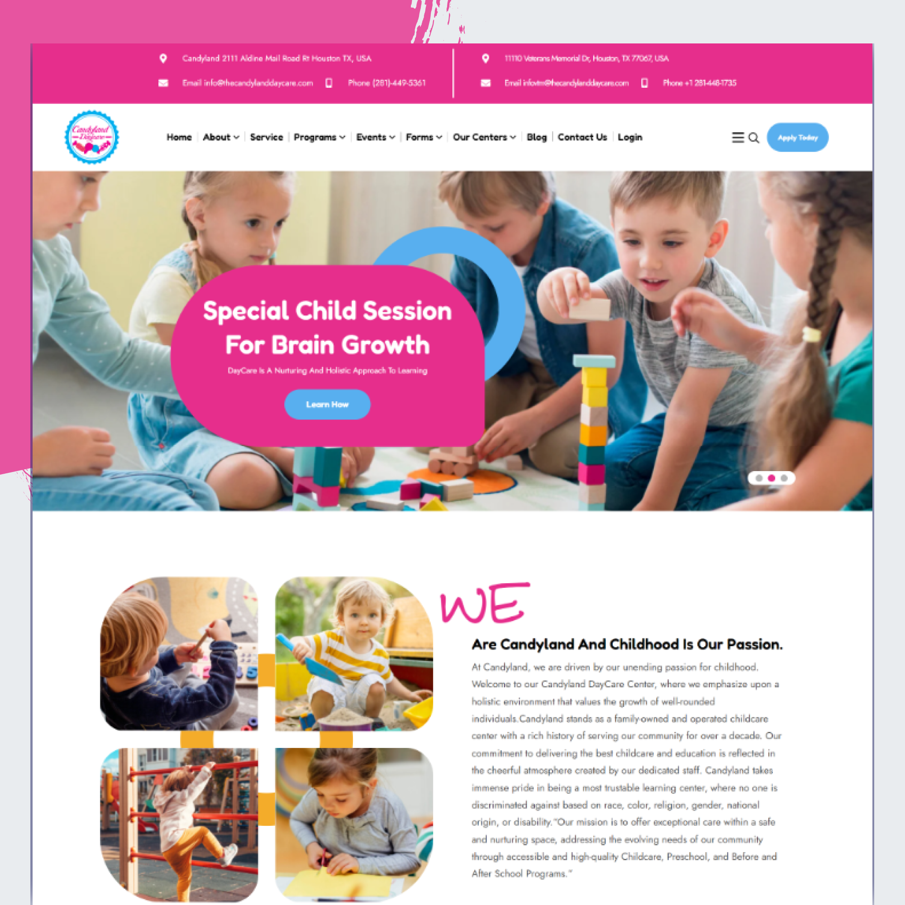
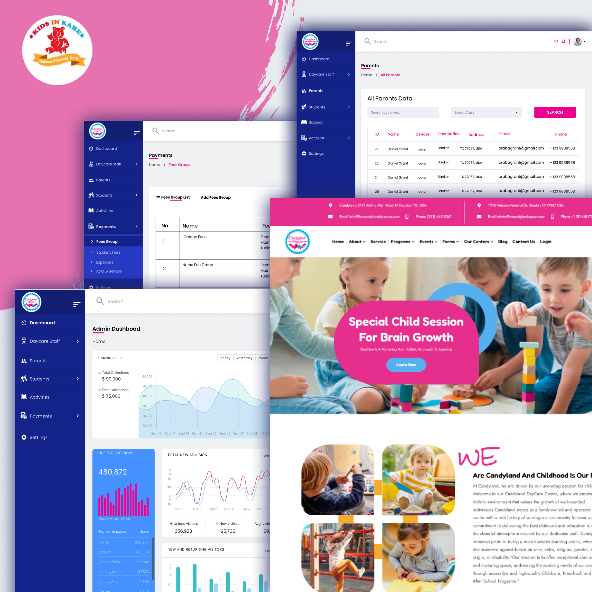
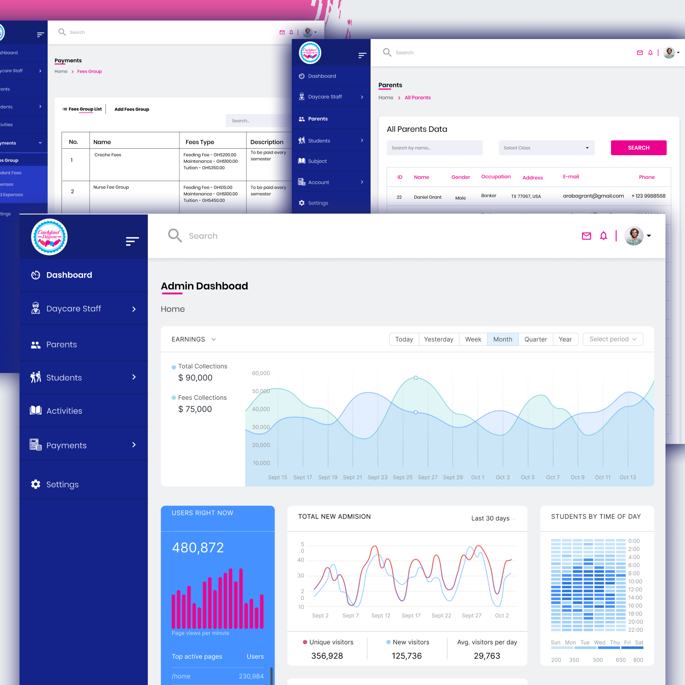
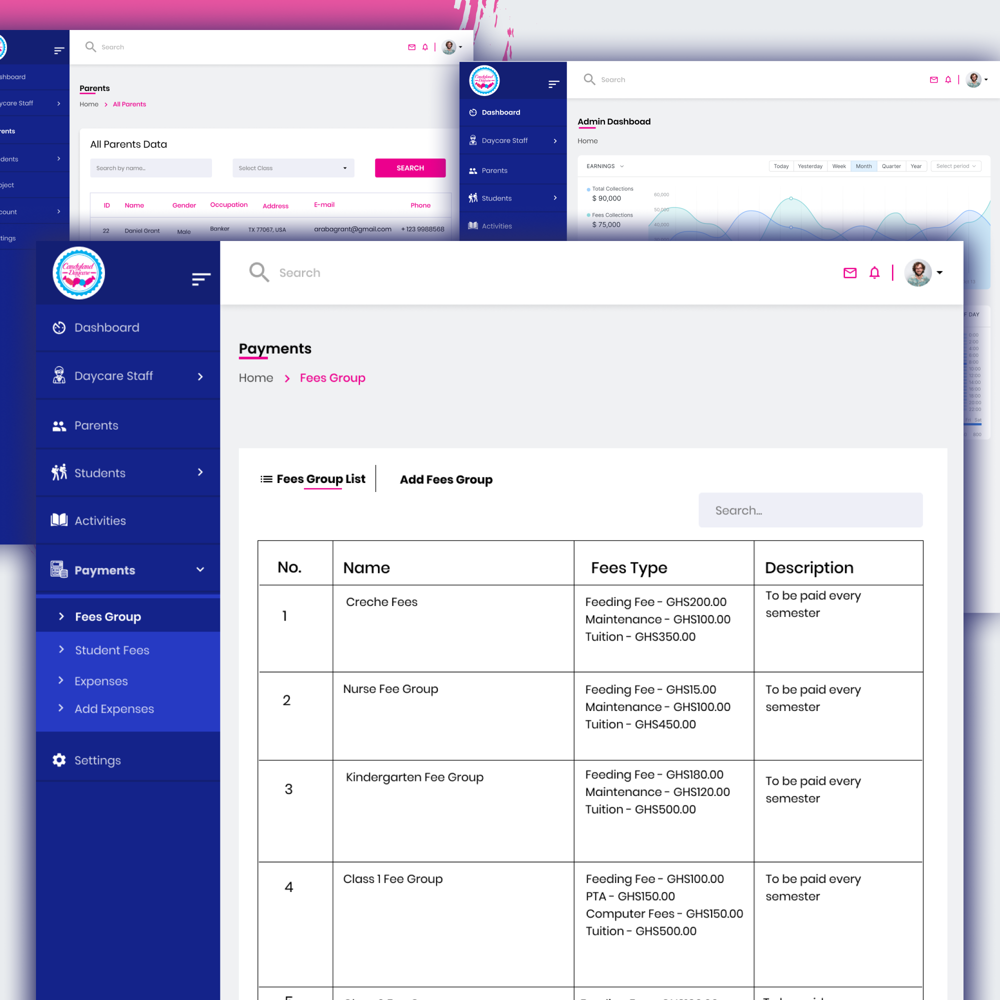
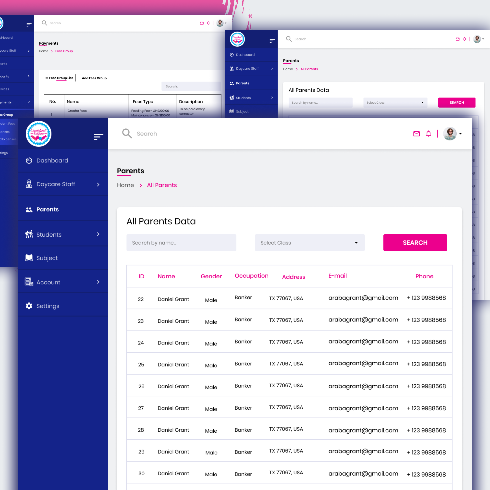

# Candyland Daycare

We developed and have been managing the website for Candyland Daycare for the past two years. Candyland Daycare provides various programs for children from infants to school-aged kids, focusing on a nurturing and holistic learning environment. The site features comprehensive details about their services, programs, team, and contact options, including a built-in contact form and the ability to schedule a tour.

Website features:
- **Service Details:** Clear and detailed descriptions of all programs offered.
- **Team Information:** Profiles of staff members, highlighting their qualifications and experience.
- **Contact Form:** Easy-to-use form for inquiries and scheduling tours.
- **News and Updates:** Section for the latest news and back-to-school information.
- **Photo Gallery:** Visual showcase of the daycare environment and activities.
- **Parent Resources:** Information and resources for parents regarding child development and education.

Note: Code not shared due to agreement with client.

